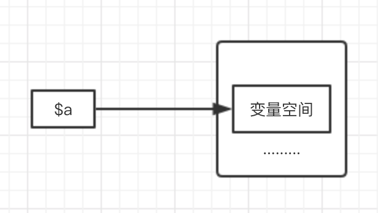
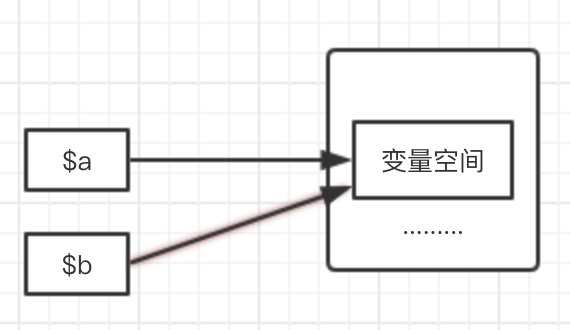
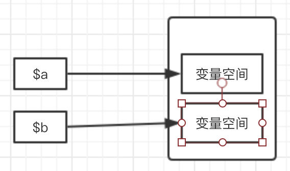

# PHP引用变量

## 1、变量
> 计算机语言中能储存计算结果或能表示值抽象概念。变量可以通过变量名访问。
变量由两部分组成，`变量名`+`变量内存空间`

>声明：只能由`数字、字母以及下划线`组成，不能以`数字`开头


## 2、引用变量概念
> 引用变量：允许使用不同的名称来操作同一变量内容


## 3、引用变量定义
> 使用&来定义引用变量，注意&只能修饰变量


## 4、引用变量使用场景
>1、使得方法或者函数可以有多个返回值（也可以返回一个数组）

例如`preg_match($pattern,$subject,&$matches = [])`函数,$matches就是一个引用变量，函数本身返回的是匹配的个数，当匹配出错时返回false
未匹配结果时返回0，否则返回1.

```php
<?php

/**
*上传文件，失败的时候还需要返回错误信息
*上传成功返回true，失败返回false
*/
function upload($filename, $des, &$error = ''){
   $file = $_FILES[$filename] ?? '';
   if (empty($file)) {
      $error = 'empty file';
      return false;
   }
   if (!move_uploaded_file($file['tmp'], $des)) {
     $error = 'move uploaded file failed';
     return false;
   }
   return true;
}
```


>2、在方法或者函数内部操作外部变量
>在函数或方法内部操作外部变量一般有4种方法：`$GLOBALS超全局数组`、`global关键字引用变量`、`其他超全局数组`以及`引用传递`

```php
<?php

$username = 'Snail';
function test(&$username){
    $username = 'ZED';
    echo $username,PHP_EOL;
}
echo $username,PHP_EOL;
test($username);
echo $username,PHP_EOL;

//输出
//Snail
//ZED
//ZED
```

## 5、PHP变量工作方式
>1）、普通变量，遵循COW机制（copy on write）

**COW机制**，当其中一个变量值发生改变时，才进行内存复制。
```php
<?php

$a = range(0,100);

$b = $a;//此时会遵循COW机制，不会进行复制，只有当a或b发生改变时才会复制

$a = range(0,100);//复制

```
整个过程如下：
>`$a = range(0,100);`



>`$b = $a;`

  

>`$a = range(0,100);//复制`

  

>2)、引用变量
>两个变量都指向同一个内存空间

  


## 6、面试真题
```php
<?php

/**

PHP笔试：
1、每次循环的结果
2、最终$data的结果
**/
$data = ['a','b','c'];

foreach($data as $k=>$v){
  $v = &$data[$k];
  var_dump($data);
}

var_dump($data);

//分析:
//foreach循环是每次把数组的key和value分别赋值给$k和$v，需要注意每次赋值给$v前，$v的引用指向。
//第1次循环把0赋值给k，a赋值给v，即$k = 0,$v = a,第一次循环完毕$v指向了$data[0],值为a, 打印结果：a,b,c
//
//第2次循环，把1赋值给k，把b赋值给v，这个时候v是指向data[0],所以data[0]= b,$k = 1,$v = b，第二次循环完毕，$v指向了$data[1]，打印结果为 b,b,c
//
//第3次循环，把2赋值给k，把c赋值给v，这个时候v是指向data[1],所以data[1]= c,$k = 1,$v = b，第二次循环完毕，$v指向了$data[1]，打印结果为 b,c,c
//最终结果 b,c,c
/**
array(3) {
  [0]=>
  &string(1) "a"
  [1]=>
  string(1) "b"
  [2]=>
  string(1) "c"
}
array(3) {
  [0]=>
  string(1) "b"
  [1]=>
  &string(1) "b"
  [2]=>
  string(1) "c"
}
array(3) {
  [0]=>
  string(1) "b"
  [1]=>
  string(1) "c"
  [2]=>
  &string(1) "c"
}
array(3) {
  [0]=>
  string(1) "b"
  [1]=>
  string(1) "c"
  [2]=>
  &string(1) "c"
}
**/
```